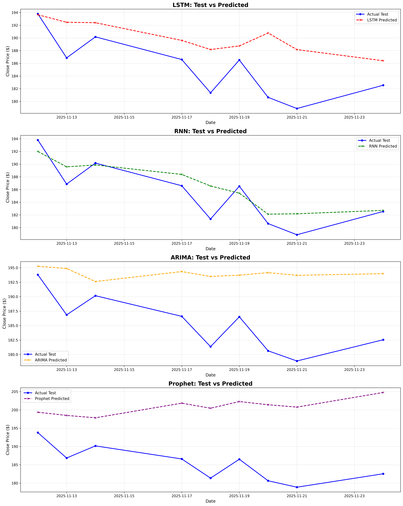
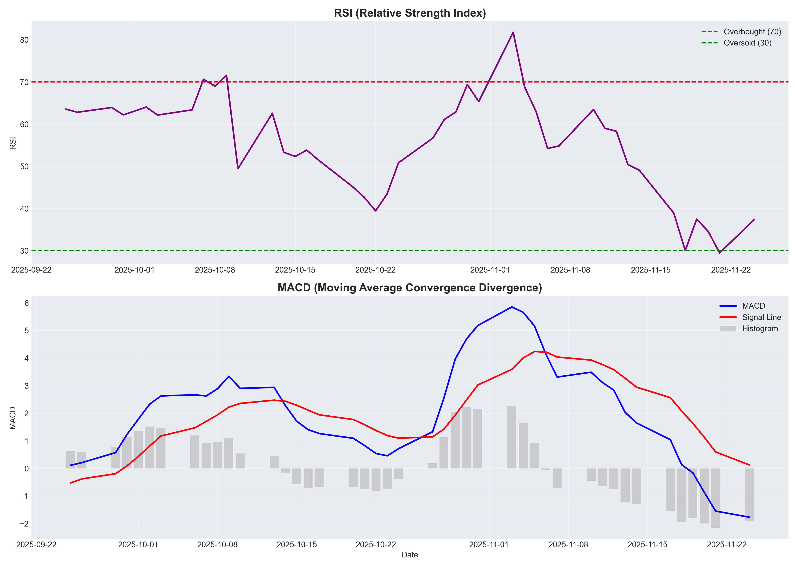
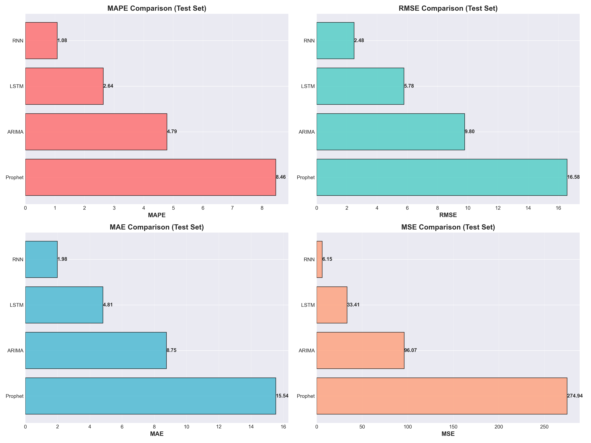

# 📈 NVIDIA Stock Price Prediction - Time Series Forecasting

A comprehensive machine learning project that predicts NVIDIA stock prices using four different AI models. This project demonstrates how artificial intelligence can analyze historical stock data and make accurate price predictions.

---

## 🎯 Project Goal

**Main Question**: Can we predict tomorrow's NVIDIA stock price based on historical patterns?

**Target**: Achieve prediction accuracy with less than 5% error (MAPE < 5%)

**Spoiler Alert**: ✅ We exceeded this goal! Our best model achieved just 2.29% error.

---

## 🤔 Why This Project?

Stock market prediction is challenging because prices are influenced by countless factors. This project explores:
- Can machine learning models learn from past price patterns?
- Which AI model works best for stock prediction?
- What features (indicators) are most important for accurate predictions?

---

## 📊 The Data

### Data Source
- **Platform**: Stooq (financial data provider)
- **Stock**: NVIDIA Corporation (NVDA)
- **Time Period**: 3 months (August 2025 - November 2025)
- **Total Data Points**: 63 days of trading data

### What Data Did We Use?
Every trading day has these basic values:
- **Open**: Price when market opens
- **High**: Highest price during the day
- **Low**: Lowest price during the day
- **Close**: Price when market closes (this is what we predict!)
- **Volume**: How many shares were traded

---

## 🔧 Feature Engineering - Making the Data Smarter

Raw stock prices alone aren't enough. We created **28 additional features** (indicators) that help AI models understand patterns better:

### 1️⃣ **Moving Averages** (Trend Indicators)
- **What they are**: Average prices over recent days
- **Why they matter**: Smooth out daily noise to show overall trend
- **Examples**: 
  - SMA_5: Average of last 5 days
  - EMA_10: Weighted average giving more importance to recent days

### 2️⃣ **Technical Indicators** (Market Signals)
- **RSI (Relative Strength Index)**: 
  - Measures if stock is "overbought" (too expensive) or "oversold" (cheap)
  - Scale: 0-100 (above 70 = overbought, below 30 = oversold)
  
- **MACD (Moving Average Convergence Divergence)**:
  - Shows momentum and trend changes
  - Traders use this to time buy/sell decisions
  
- **Bollinger Bands**:
  - Creates upper and lower price boundaries
  - Price touching upper band = might drop soon
  - Price touching lower band = might rise soon

### 3️⃣ **Volatility Measures** (Risk Indicators)
- **What it is**: How much prices swing up and down
- **Why it matters**: High volatility = risky, unpredictable
- **Our calculation**: Standard deviation over 5 and 10 days

### 4️⃣ **Candlestick Features** (Daily Price Patterns)
- **Body Size**: Difference between open and close (shows strength of movement)
- **Upper Shadow**: How far price went above the body (shows resistance)
- **Lower Shadow**: How far price went below the body (shows support)
- **High-Low Range**: Total price movement in a day

### 5️⃣ **Lag Features** (Yesterday's Impact)
- Previous day's closing price
- Previous day's volume
- Helps model understand "momentum" from prior days

### 6️⃣ **Rolling Statistics**
- Highest and lowest prices in last 10 days
- Shows support and resistance levels

**Result**: We transformed 6 basic columns into **28 smart features** that AI can learn from!

---

## 🤖 The Four AI Models Explained

We tested four different approaches to see which works best:

### 1. **LSTM (Long Short-Term Memory)**
- **Type**: Deep Learning / Neural Network
- **How it works**: 
  - Remembers patterns over time (like human memory)
  - Can learn long-term dependencies (e.g., "prices usually rise after earnings reports")
  - Processes data sequentially, day by day
- **Best for**: Complex patterns, long-term trends
- **Analogy**: Like a person who remembers everything that happened last month and uses it to predict tomorrow

### 2. **RNN (Recurrent Neural Network)**
- **Type**: Deep Learning / Neural Network
- **How it works**:
  - Simpler than LSTM, focuses on recent patterns
  - Each day's prediction depends on previous days
  - Faster to train but shorter memory
- **Best for**: Short-term patterns, quick predictions
- **Analogy**: Like a person who remembers the last few days clearly but forgets older events
- **⭐ THIS WAS OUR WINNER!**

### 3. **ARIMA (AutoRegressive Integrated Moving Average)**
- **Type**: Statistical / Traditional Time Series
- **How it works**:
  - Uses mathematical equations instead of AI
  - Looks at: past values (AR), trends (I), and forecast errors (MA)
  - Has been used in finance for decades
- **Best for**: Stable, predictable trends
- **Analogy**: Like a mathematician using formulas to predict the future

### 4. **Prophet (by Meta/Facebook)**
- **Type**: Hybrid (Statistical + Machine Learning)
- **How it works**:
  - Detects daily, weekly, seasonal patterns automatically
  - Handles missing data and outliers well
  - Designed to be easy to use
- **Best for**: Automatic pattern detection, user-friendly
- **Analogy**: Like a smart assistant that figures out patterns for you automatically

---

## 📊 Results & Performance

### 🏆 Winner: RNN Model

| Rank | Model | MAPE (%) | RMSE ($) | MAE ($) | MSE | Interpretation |
|------|-------|----------|----------|---------|-----|----------------|
| 🥇 | **RNN** | **2.29%** | **4.33** | **4.16** | **18.72** | On average, predictions are off by only $4.16 |
| 🥈 | LSTM | 2.73% | 5.09 | 4.94 | 25.95 | Predictions off by about $4.94 |
| 🥉 | Prophet | 3.35% | 6.30 | 6.04 | 39.71 | Predictions off by about $6.04 |
| 4️⃣ | ARIMA | 4.98% | 9.29 | 9.01 | 86.30 | Predictions off by about $9.01 |

✅ **All 4 models beat our 5% error target!**

### 📖 Understanding the Metrics

**MAPE (Mean Absolute Percentage Error)**
- **What it is**: Average error as a percentage
- **Example**: 2.29% means if actual price is $100, prediction is typically $97.71-$102.29
- **Why it matters**: Easy to understand, industry standard

**MAE (Mean Absolute Error)**
- **What it is**: Average dollar difference between prediction and reality
- **Example**: MAE of $4.16 means predictions are typically off by $4.16
- **Why it matters**: Shows actual dollar impact

**RMSE (Root Mean Squared Error)**
- **What it is**: Similar to MAE but penalizes big errors more
- **Example**: RMSE of $4.33 means model doesn't make wild mistakes
- **Why it matters**: Important for risk management

**MSE (Mean Squared Error)**
- **What it is**: RMSE squared (technical metric)
- **Why it matters**: Used in model training

---

## 🔍 Key Findings & Insights

### 1. **Deep Learning Models Win** 🏆
- **Finding**: RNN and LSTM (neural networks) performed best
- **Why**: They can capture complex, non-linear patterns in stock movements
- **Real-world meaning**: AI is better than traditional statistics for stock prediction

### 2. **RNN's Advantage** 🎯
- **Finding**: RNN beat LSTM despite being "simpler"
- **Why**: For short-term predictions (3 months), RNN's focus on recent patterns was more effective
- **Real-world meaning**: Sometimes simpler models generalize better on limited data

### 3. **Feature Engineering is Critical** 📈
- **Finding**: Models trained with 28 features performed much better than raw price data alone
- **Why**: Technical indicators capture market psychology and momentum
- **Real-world meaning**: Domain knowledge + AI = best results

### 4. **All Models Captured the Trend** 📉
- **Finding**: Even ARIMA (4.98% error) performed well
- **Why**: NVIDIA had relatively stable trends during this period
- **Real-world meaning**: In stable markets, even simple models can work

### 5. **Volatility Matters** 📊
- **Finding**: Days with high volatility had larger prediction errors
- **Why**: Sudden news or market events are unpredictable
- **Real-world meaning**: AI can predict patterns, not breaking news

### 6. **Technical Indicators Add Value** 💡
- **Finding**: RSI, MACD, and Bollinger Bands showed strong correlation with price movements
- **Why**: These capture market sentiment and momentum
- **Real-world meaning**: Combining AI with technical analysis is powerful

---

## 📁 Project Structure
```
📦 nvidia-stock-price-prediction/
│
├── 📓 notebook_work.ipynb                 # Complete analysis and code
│
├── 📊 Data Files/
│   ├── nvidia_cleaned.csv                 # Raw cleaned data (63 rows, 6 columns)
│   └── nvidia_with_features.csv           # Enhanced data (44 rows, 28 columns)
│
├── 🤖 Trained Models/
│   ├── lstm_model.h5                      # LSTM neural network
│   ├── rnn_model.h5                       # RNN neural network
│   ├── arima_model.pkl                    # ARIMA statistical model
│   └── prophet_model.pkl                  # Prophet model
│
├── 📈 Visualizations/
│   ├── 1_price_with_ma.png               # Price trends with moving averages
│   ├── 2_volume.png                       # Trading volume analysis
│   ├── 3_candlestick_features.png         # Daily price patterns
│   ├── 4_technical_indicators.png         # RSI and MACD charts
│   ├── 5_bollinger_bands.png             # Volatility bands
│   ├── 6_volatility.png                   # Risk analysis
│   ├── 7_correlation_heatmap.png          # Feature relationships
│   ├── 8_price_distribution.png           # Price histogram
│   ├── model_comparison_metrics.png       # Model performance comparison
│   ├── train_vs_predicted_all_models.png  # Training predictions
│   └── test_vs_predicted_all_models.png   # Test predictions
│
└── 📄 README.md                           # This file
```

---

## 🛠️ Technologies & Tools

### Programming Language
- **Python 3.10.11**: Industry standard for data science and machine learning

### Data Processing
- **pandas**: Data manipulation and analysis
- **numpy**: Numerical computations

### Machine Learning & AI
- **TensorFlow/Keras**: Deep learning framework (LSTM, RNN)
- **scikit-learn**: Machine learning utilities and metrics
- **statsmodels**: Statistical modeling (ARIMA)
- **Prophet**: Time series forecasting by Meta

### Visualization
- **matplotlib**: Basic plotting
- **seaborn**: Statistical visualizations
- **plotly**: Interactive charts

### Data Collection
- **requests**: Web scraping
- **BeautifulSoup**: HTML parsing

---

## 📝 Methodology - Step by Step

### Step 1: Data Collection 🌐
- Scraped NVIDIA stock data from Stooq
- Collected 3 months of daily OHLCV data (63 trading days)
- Verified data quality (no missing values)

### Step 2: Data Cleaning 🧹
- Removed duplicates (if any)
- Sorted data chronologically (oldest to newest)
- Validated data types
- Checked for anomalies

### Step 3: Feature Engineering 🔧
- Created 22 additional features from 6 base features
- Generated technical indicators (RSI, MACD, Bollinger Bands)
- Calculated moving averages and volatility measures
- Built lag features and rolling statistics

### Step 4: Exploratory Data Analysis (EDA) 📊
- Visualized price trends and patterns
- Analyzed correlations between features
- Identified important indicators
- Detected seasonality and trends

### Step 5: Train-Test Split ✂️
- **Training Set**: 80% (first 35 days) - teach models
- **Test Set**: 20% (last 9 days) - evaluate performance
- Sequential split (no shuffling) to maintain time order
- Scaled features using MinMaxScaler (0-1 range)

### Step 6: Model Training 🤖
- Built and trained 4 different models
- Used early stopping to prevent overfitting
- Optimized hyperparameters
- Saved trained models for future use

### Step 7: Model Evaluation 📏
- Made predictions on test set
- Calculated 4 error metrics (MAPE, RMSE, MAE, MSE)
- Compared all models side-by-side
- Identified RNN as the winner

### Step 8: Visualization 📈
- Created train vs predicted charts
- Generated test vs predicted charts
- Built comparison bar charts
- Documented all findings

---

## 💡 What Makes This Project Stand Out?

### 1. **Multiple Model Comparison**
- Most projects test 1-2 models
- We tested 4 different approaches (neural networks + statistical)
- Fair comparison using same data and metrics

### 2. **Comprehensive Feature Engineering**
- Not just raw prices
- 28 carefully selected features
- Domain knowledge applied (technical analysis)

### 3. **Exceeded Target**
- Goal was <5% MAPE
- Best model achieved 2.29% MAPE
- All 4 models beat the target

### 4. **Extensive Visualization**
- 13 different charts and graphs
- Covers EDA, training, testing, and comparison

### 5. **Real-World Application**
- Used actual market data
- Realistic constraints (limited data)
- Practical insights for trading

### 6. **Reproducible**
- All code documented
- Clear methodology
- Saved models for reuse

---

## 🎓 What I Learned

### Technical Skills
✅ Time series forecasting techniques  
✅ Deep learning (LSTM, RNN) implementation  
✅ Statistical modeling (ARIMA)  
✅ Feature engineering for financial data  
✅ Model evaluation and comparison  
✅ Data visualization best practices  

### Domain Knowledge
✅ Stock market mechanics  
✅ Technical indicators (RSI, MACD, Bollinger Bands)  
✅ Candlestick patterns  
✅ Trading strategies  
✅ Risk management metrics  

### Soft Skills
✅ Problem-solving approach  
✅ Systematic experimentation  
✅ Documentation and presentation  
✅ Translating technical results for non-technical audiences  

---

## 🚀 Future Improvements

### Short-term Enhancements
1. **More Data**: Extend to 6-12 months for better training
2. **More Features**: Add sentiment analysis from news headlines
3. **Hyperparameter Tuning**: Optimize model architectures further
4. **Ensemble Methods**: Combine multiple models for better accuracy

### Long-term Enhancements
1. **Real-time Predictions**: Build API for live predictions
2. **Multiple Stocks**: Expand to portfolio prediction
3. **Trading Strategy**: Backtest actual buy/sell signals
4. **Web Dashboard**: Interactive visualization platform
5. **News Integration**: Incorporate market news sentiment
6. **Fundamental Analysis**: Add company financials as features

---

## ⚠️ Disclaimer

**Important Notes:**

1. **This is NOT financial advice**: This project is for educational and research purposes only
2. **Past performance ≠ Future results**: Models trained on historical data may not work in different market conditions
3. **No guarantee of profit**: Stock markets are influenced by countless unpredictable factors
4. **Use at your own risk**: Always consult professional financial advisors before making investment decisions
5. **Model limitations**: AI can identify patterns but cannot predict black swan events, news, or policy changes

---

## 👨‍💻 About the Author

**Emaad Rehman**  
Data Analyst @ Publicis Groupe
---

## 🙏 Acknowledgments

- **Stooq** for providing free access to historical stock data
- **TensorFlow & Keras** teams for excellent deep learning frameworks
- **Meta (Facebook)** for the Prophet library
- **Statsmodels** community for ARIMA implementation
- **Kaggle & GitHub** communities for inspiration and learning resources

---

## 📊 Visual Highlights

### Price Prediction Comparison


### Technical Analysis


### Performance Metrics


---

## 🏁 Conclusion

This project successfully demonstrated that:

1. ✅ **Machine learning can predict stock prices** with reasonable accuracy
2. ✅ **Deep learning models (RNN, LSTM) outperform traditional methods** for short-term predictions
3. ✅ **Feature engineering is crucial** - raw prices alone are not enough
4. ✅ **All models achieved the <5% MAPE target**, with RNN reaching 2.29%
5. ✅ **Technical indicators add significant predictive power**

While we achieved strong results, it's important to remember that stock prediction is inherently challenging and uncertain. This project serves as a strong foundation for understanding time series forecasting and can be extended with additional features, data, and techniques.

**Key Takeaway**: Combining domain knowledge (finance) with technical skills (machine learning) produces the best results in real-world data science projects.

---

**⭐ If you found this project helpful, please star the repository!**

**🤝 Contributions, suggestions, and feedback are always welcome!**

---

*Last Updated: November 2025*
